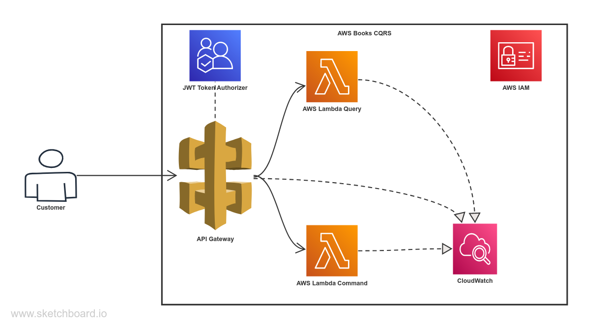

# Books CQRS on top of AWS Lambda

Serverless example that demonstrates how to deploy multiples serverless solutions behind an api gateway, fully IaaC and written in terrafom while being orchestrated by makefiles providing more not only linux friendship but extensible, and reproductible and definitely more reliable, at least in terms of ci/cd.

The repo aims to define a CQRS `fake` implementation on top of AWS Lambdas, API Gateway and [OpenIDConnect](https://openid.net/connect/).

## Assumptions

  - CQRS Implementation: The objective of this exercise is oriented to the deployment and its automation so for that **api responses are hardcoded**

  - AWS Authentication: In order to run this project, *devops* must be properly authenticated in AWS. At the time of written, [aws-vault](https://github.com/99designs/aws-vault) could be the solution.
  `AWS_SESSION_TOKEN` is what you are looking for.

  - Terraform remote state is out of the scope. For this playground, local state is mandatory. Please not that infra must be destroyed at the end of the work.

  - Command and Query functionality is out of the scope. One can query and the other one can write.

  - Authentication: For the purpose of this exercise, `GET` is publica while `POST` involves:
    - Create an OpenIdConnect provider and replace the var called `jwt_authorizer` in [variables.tf](./variables.tf) with your own provider

  - Due to a **known limitation** with terraform and api-gateway, *devops engineers* need 
    - run twice `make terraform-apply`
    - set parallelism=1in terraform commands (TF_PARALLELISM) that actually impacts on performance

## Main Requirements

Following requirements are a must
 - Read and Write books in the catalog 
 providing customers with the most elegant solutions for any books catalog
 - HTTP Interface for both, `command and query`
 - Separation of concerns: Command and Query Services
 - Use of AWS Lambdas on top of Docker
 - IaaC: All infra as a code
 - Logging: On top of CloudWatch
 - Auth: On top of API Gateway (JWT Authorizer)
 - Continuous Integration and Delivery: ECR
 - Deployment: One click deployment on top of make commands


## Dependencies

In order to be able to execute commands, the following dependencies must be properly installed.

 - Linux :)
 - python 3.8
 - pip
 - terraform 1.3.6
  - docker

## How to use

### Continuous Integration and Delivery

In order to run ci/cd, the app is going to be built firstly:

> make docker-build

And then delivered

> make docker-delivery


### Deployment

Once the [semantic versioning](https://semver.org/) defined in [version.txt] has been delivered, the deployment part is ready to be rolled out.

> make terraform init

> make terraform-deploy

To destroy the infra, please run:

> make terraform-destroy

**Note** that lambdas are being able to be rolled out because `image_uri` points to their `sha256` value.

### Test

In the folder called test, there is a bash script to test query and command endpoints.
Query is open and Command is authenticated by JWT Authroizer on top of `oAuth0`

Open the file and set the proper values for:

 - `TEST_ACCESS_TOKEN`: Obtained from your IdP
 - `API_URL`: Obtained as terraform output

then run:

> bash ./test/integration-test.sh

## Architecture

Following Image describes the architecture implemented in this component.



### IaaC

This components aims to be fully automated using terraform as IaaC tool and taking advantage of their comunity modules.

To work in terraform for production purposes involves to have an s3 bucket to store the tf_state file remotly and a dynamo db table for lockings. Due to the target of this project, this step is skiped.

For this component, following terraform aws comunity modules are used:

 - [aws lambdas](https://registry.terraform.io/modules/terraform-aws-modules/lambda/aws/latest)
 - [aws api-gateway v2](https://registry.terraform.io/modules/terraform-aws-modules/apigateway-v2/aws/latest)

### Identity Provider

This projects uses `OIDC` and `oAuth` as Identity Standar Solution as well as integrated in AWS on top of [Api Gateway JWT Authorizers](https://docs.aws.amazon.com/apigateway/latest/developerguide/http-api-jwt-authorizer.html). 

For this exercise the identity provider, [Auth0](https://auth0.com/) is the preferred one.

Check the issuer here:

> https://dev-jnunrkz8y4jtwkaz.eu.auth0.com/.well-known/openid-configuration

## Known Limitations

Due to an issue on aws api gateway, in order to deploy the solution, devops have to deal with one of the followinf situation:
  - run twice `make terraform-apply` *OR*
  - set parallelis=1 that impacts of performance

Following output shows the case:

```
module.api_gateway.aws_apigatewayv2_route.this["$default"]: Creation complete after 1s [id=5lf15gi]
╷
│ Error: creating API Gateway v2 stage: NotFoundException: Unable to find Route by key POST /v1/catalog/books within the provided RouteSettings
│ {
│   RespMetadata: {
│     StatusCode: 404,
│     RequestID: "7e9f60dd-ae77-47c4-a1ed-4e806a084837"
│   },
│   Message_: "Unable to find Route by key POST /v1/catalog/books within the provided RouteSettings"
│ }
│ 
│   with module.api_gateway.aws_apigatewayv2_stage.default[0],
│   on .terraform/modules/api_gateway/main.tf line 63, in resource "aws_apigatewayv2_stage" "default":
│   63: resource "aws_apigatewayv2_stage" "default" {
│ 
╵
╷
│ Error: error creating API Gateway v2 route: ConflictException: Unable to complete operation due to concurrent modification. Please try again later.
│ 
│   with module.api_gateway.aws_apigatewayv2_route.this["GET /v1/catalog/books/{id}"],
│   on .terraform/modules/api_gateway/main.tf line 124, in resource "aws_apigatewayv2_route" "this":
│  124: resource "aws_apigatewayv2_route" "this" {

```

See more info about the bug [here](https://github.com/hashicorp/terraform-provider-aws/issues/18018)

## References

 - https://auth0.com/blog/securing-aws-http-apis-with-jwt-authorizers/

## Author

* javigs82 [github](https://github.com/javigs82/)
